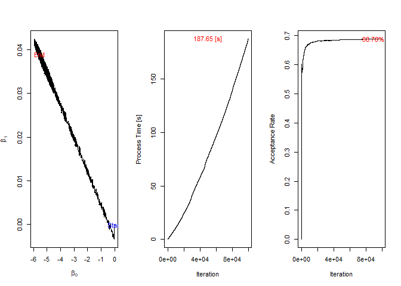
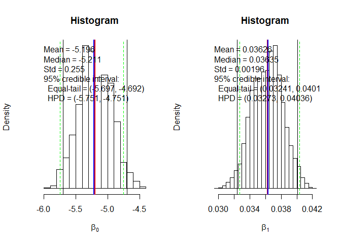
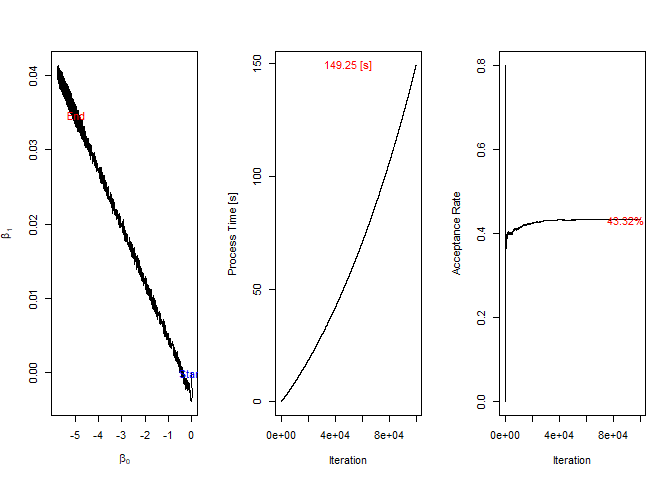
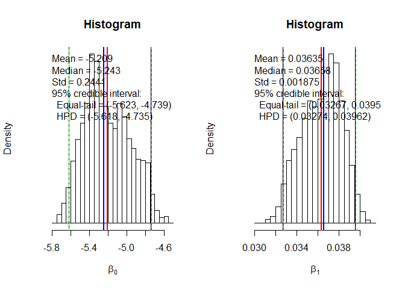

MCMC Sampling for a Logistic Regression Model
================
Chien-Lan Hsueh
2023-11-10

- [Packages](#packages)
- [Data](#data)
- [MCMC MH Algorithm and
  Implementation](#mcmc-mh-algorithm-and-implementation)
- [Simulation and Results](#simulation-and-results)
- [GLM - MLE fit](#glm---mle-fit)
- [Additional Study - MCMC MH Bivariate
  Manner](#additional-study---mcmc-mh-bivariate-manner)
- [Comparison and Conclusion](#comparison-and-conclusion)

## Packages

The following packages are used in this project:

- `here`: enables easy file referencing and builds file paths in a
  OS-independent way
- `stats`: loads this before loading `tidyverse` to avoid masking some
  `tidyverse` functions
- `cumstats`: efficiently computing cumulative standard deviation
- `tidyverse`: includes collections of useful packages like `dplyr`
  (data manipulation), `tidyr` (tidying data), `ggplots` (creating
  graphs), etc.
- `skimr`: provide summary statistics about variables in data frames,
  tibbles, data tables and vectors
- `glue`: embedding and evaluating R expressions into string to be
  printed as message
- `scales`: formats and labels scales nicely for better visualization
- `broom`: tidy and unify the fit objects returned by most of the
  modeling functions
- `TeachingDemos`: empirical HPD intervals

In addition, the `pacman` package provides handy tools to manage R
packages (install, update, load and unload). We use its `p_laod()`
instead of `libarary()` to load the packages listed above.

``` r
# packages
if (!require("pacman")) utils::install.packages("pacman", dependencies = TRUE)
```

    ## Loading required package: pacman

``` r
pacman::p_load(
    here,
    stats, cumstats,
    tidyverse, 
    skimr, glue, scales, gt,
    broom, 
    TeachingDemos
)

# helper function: string concatenation (ex: "act" %&% "5")
'%&%' <- function(x, y) paste0(x, y)

# not %in%
'%notin%' <- Negate('%in%')
```

In this work, we reuse one of the helper function we developed before
`dist_summary`. It conveniently gives graphical (histogram) and numeric
summaries (mean, median, standard deviation and confidence intervals) of
a distribution from a vector. In this updated version, we add the
credible intervals by using `TeachingDemos::CI_hpd()`.

Arguments:

- `x`: A numeric vector
- `var_expression`: expression used in plot axis label
- `pos_x`, `pos_y`, `adj`: position of text annotation on the plot
- `conf.level`: confidence level
- `digits`: number of decimal places
- `plot`: include plot or not

Value: A data frame with numeric summaries

``` r
# summarize a distribution (graphically and numerically)
dist_summary <- function(
    x, var_expression,
    pos_x = 0, pos_y = 1, adj = c(0, 1),
    conf.level = 0.95, digits = 4, plot = T, ...){
  
  # significance level
  alpha <- (1 - conf.level)/2
  
  # mean, median, and intervals
  mean <- mean(x)
  median <- median(x)
  sd <- sd(x)
  CI <- quantile(x, probs = c(alpha, 1 - alpha)) %>% `names<-`(vec_fmt_percent(c(alpha, 1 - alpha), decimals = 1))
  CI_hpd <- TeachingDemos::emp.hpd(x) %>% `names<-`(vec_fmt_percent(c(alpha, 1 - alpha), decimals = 1))

  if(plot){
    # plot distributions with annotations of mean, median and CIs
    hist_obj <- hist(
      x, 
      probability = T, 
      col = NULL,
      yaxt = "n",
      xlab = var_expression, 
      main = "Histogram")
    
    # add lines
    abline(v = mean, col = "red", lwd = 2)
    abline(v = median, col = "blue", lwd = 2)
    abline(v = CI)
    abline(v = CI_hpd, lty = 2, col = "green")
    
    # annotation
    text(
      quantile(hist_obj$breaks, probs = pos_x),
      quantile(hist_obj$density, probs = pos_y),
      glue(
        "Mean = {signif(mean, digits)}\n",
        "Median = {signif(median, digits)}\n",
        "Std = {signif(sd, digits)}\n",
        "{conf.level*100}% credible interval:\n",
        "  Equal-tail = ({toString(signif(CI, digits))})\n",
        "  HPD = ({toString(signif(CI_hpd, digits))})\n"
      ),
      adj = adj, ...)
  }
  
  # return summaries
  return(tibble(
    mean = mean,
    median = median,
    sd = sd,
    CI = list(CI),
    CI_hpd = list(CI_hpd)
  ))
}
```

## Data

Load the data and have a quick look at it to check its summary, data
type and completeness:

``` r
diabetes <- read_csv("diabetes-dataset.csv", show_col_types = F)

# skim the data 
skim(diabetes)
```

|                                                  |          |
|:-------------------------------------------------|:---------|
| Name                                             | diabetes |
| Number of rows                                   | 2000     |
| Number of columns                                | 9        |
| \_\_\_\_\_\_\_\_\_\_\_\_\_\_\_\_\_\_\_\_\_\_\_   |          |
| Column type frequency:                           |          |
| numeric                                          | 9        |
| \_\_\_\_\_\_\_\_\_\_\_\_\_\_\_\_\_\_\_\_\_\_\_\_ |          |
| Group variables                                  | None     |

Data summary

**Variable type: numeric**

| skim_variable            | n_missing | complete_rate |   mean |     sd |    p0 |   p25 |    p50 |    p75 |   p100 | hist  |
|:-------------------------|----------:|--------------:|-------:|-------:|------:|------:|-------:|-------:|-------:|:------|
| Pregnancies              |         0 |             1 |   3.70 |   3.31 |  0.00 |  1.00 |   3.00 |   6.00 |  17.00 | ▇▃▂▁▁ |
| Glucose                  |         0 |             1 | 121.18 |  32.07 |  0.00 | 99.00 | 117.00 | 141.00 | 199.00 | ▁▁▇▆▂ |
| BloodPressure            |         0 |             1 |  69.15 |  19.19 |  0.00 | 63.50 |  72.00 |  80.00 | 122.00 | ▁▁▇▇▁ |
| SkinThickness            |         0 |             1 |  20.93 |  16.10 |  0.00 |  0.00 |  23.00 |  32.00 | 110.00 | ▇▇▁▁▁ |
| Insulin                  |         0 |             1 |  80.25 | 111.18 |  0.00 |  0.00 |  40.00 | 130.00 | 744.00 | ▇▂▁▁▁ |
| BMI                      |         0 |             1 |  32.19 |   8.15 |  0.00 | 27.37 |  32.30 |  36.80 |  80.60 | ▁▇▇▁▁ |
| DiabetesPedigreeFunction |         0 |             1 |   0.47 |   0.32 |  0.08 |  0.24 |   0.38 |   0.62 |   2.42 | ▇▃▁▁▁ |
| Age                      |         0 |             1 |  33.09 |  11.79 | 21.00 | 24.00 |  29.00 |  40.00 |  81.00 | ▇▃▁▁▁ |
| Outcome                  |         0 |             1 |   0.34 |   0.47 |  0.00 |  0.00 |   0.00 |   1.00 |   1.00 | ▇▁▁▁▅ |

There is no missing values in any column. The response variable
`Outcome` is numeric and has two possible values.

``` r
# count table for the response variable
table(diabetes$Outcome)
```

    ## 
    ##    0    1 
    ## 1316  684

## MCMC MH Algorithm and Implementation

In this work, we are interested to model the response `Outcome` by
`Glucose` with a logistic linear regression model:

$$Y=\log\frac{P(success)}{1-P(success)}=\beta_0+\beta_1 X$$

The likelihood (data) is a product of binomial pdf and the prior
distributions for the parameters $\beta_0$ and $\beta_1$ are chosen to
be two independent normal distributions $\sim N(0, 15^2)$:

$$
\begin{aligned}
L &= f_{\underset{\sim}{\beta_0}, \underset{\sim}{\beta_1}|\mathbf{Y}}(\beta_0,\beta_1|\mathbf{y}) \\
&\propto f_{\mathbf{Y}|\underset{\sim}{\beta_0}, \underset{\sim}{\beta_1}}(\mathbf{y}|\beta_0,\beta_1) \cdot
f_\underset{\sim}{\beta_0}(\beta_0) f_\underset{\sim}{\beta_1}(\beta_1) \\
&\propto \prod_{i=1}^n \left[ p(x_i)^{y_i} \cdot \left(1-p(x_i) \right)^{1-y_i} \right] \times 
\left[ \sigma_0^2 \cdot e^{  (\beta_0-\beta_{00})^2/\sigma_0^2 } \right]^{-1/2} \times 
\left[ \sigma_1^2 \cdot e^{  (\beta_1-\beta_{10})^2/\sigma_1^2 } \right]^{-1/2} \\
l &= \ln L \\
&= \sum_{i=1}^n \left[ y_i\ln p(x_i) + (1-y_i)\ln \left(1 - p(x_i)\right) \right] 
-\frac{1}{2} \left(\ln \sigma_0^2 + \frac{(\beta_0-\beta_{00})^2}{\sigma_0^2} \right)
-\frac{1}{2} \left(\ln \sigma_1^2 + \frac{(\beta_1-\beta_{10})^2}{\sigma_1^2} \right) + \text{constant} 
\end{aligned}
$$

Based on the equations above, we therefore define the following helper
functions to calculate the terms needed in MCMC MH algorithm:

- `expit()`: calculate the expit $p(x_i|\beta_0,\beta_1)$
- `logprior()`: log prior for $\beta_0 \sim N(0, 15^2)$ or
  $\beta_1 \sim N(0, 15^2)$
- `logpost()`: log posterior (the last equation showed above)

``` r
# calculate p
expit <- function(X, beta0, beta1) {
  return( 1/(1 + exp(-beta0 - beta1*X)) )
}

# log prior for beta
logprior <- function(beta, mean = 0, sd = 15) {
  return( -0.5*(log(sd^2) + (beta - mean)^2/sd^2) )
}

# log posterior
logpost <- function(Y, X, beta0, beta1){
  P <- expit(X, beta0, beta1)
  return( sum(Y*log(P) + (1-Y)*log(1-P)) + logprior(beta0) + logprior(beta1) )
}
```

Next we define a sampler function to carry out Markov Chain Monte Carlo
(MCMC) Metropolis-Hastings algorithm in a **univariate** manner (search
one parameter at a time). To compare the performance, we also keep track
of the process time `proc_time` and if a proposed candidate is accepted
`accept`. In each iteration:

- if both candidates are accepted, `accept = 1` (100% acceptance)
- if only one is accepted, `accept = 0.5` (50% acceptance)
- if none is accepted, `accept = 0`

Arguments:

- `Y`, `X`: response and prediction variables
- `N`: number of MCMC iteration
- `beta0_init` and `beta0_init`: initial values of the parameters
- `pos_x`, `pos_y`, `adj`: position of text annotation on the plot
- `proposed_sd0` and `proposed_sd1`: standard deviation of jumping
  distribution for parameter candidates
- `seed`: seed for random number generator

Value: A data frame with all sampled values of the parameters, process
time and acceptance indicator

``` r
# MCMC MH sampler - univariate manner
mcmc_mh <- function(
    Y, X, N = 1000 * 10, 
    beta0_init = 0, proposed_sd0 = 0.01, 
    beta1_init = 0, proposed_sd1 = 0.01, 
    seed = 2022){
  
  # make the simulation reproducible
  if(!is.null(seed)) set.seed(seed)
  
  # start timer
  proc_timer <- proc.time()
  
  # set up a data frame to store beta0 and beta1
  df <-  tibble(
    beta0 = beta0_init, 
    beta1 = beta1_init, 
    proc_time = (proc.time() - proc_timer)["elapsed"],
    accept = 0
  )
  
  # current step - initialize
  beta0 <- beta0_init
  beta1 <- beta1_init
  
  # log posterior for the current step
  l <- logpost(Y, X, beta0, beta1)
  
  # iteration
  for (i in 2:N) {
    # reset accept score
    accept <- 0
    
    # beta0: pick a candidate 
    beta0_new <- rnorm(1, beta0, proposed_sd0)
    # new log posterior
    l_new <- logpost(Y, X, beta0_new, beta1)
    # decide whether to accept or reject
    lnR <- l_new - l
    lnU <- log(runif(1))
    if(lnR > lnU){ 
      beta0 <- beta0_new 
      l <- l_new
      accept <- accept + 0.5
    }
    
    # beta1: pick a candidate 
    beta1_new <- rnorm(1, beta1, proposed_sd1)
    # new log posterior
    l_new <- logpost(Y, X, beta0, beta1_new)
    lnR <- l_new - l
    lnU <- log(runif(1))
    if(lnR > lnU){ 
      beta1 <- beta1_new 
      l <- l_new
      accept <- accept + 0.5
    }
    
    # save betas and elapsed time
    df <- df %>% add_row(
      beta0 = beta0, 
      beta1 = beta1,
      proc_time = (proc.time() - proc_timer)["elapsed"],
      accept = accept
    )
  }
  
  print(glue(
    "Last values: (beta0, beta1) = ({beta0}, {beta1})\n",
    "Process time [s]: {tail(df$proc_time, 1)}\n",
    "Acceptance rate: {mean(df$accept)}"
  ))
  
  # return all betas
  return(df)
}
```

The following helper function is to summarized sampled values returned
by MCMC sampler function. It creates several plots to show how algorithm
is executed (steps, process time and acceptance rate) as well as a
summary report on obtained beta values (posterior mean, median and
credible intervals):

Arguments:

- `df`: a data frame with all sampled values
- `burn_in`: number of burn_in iteration to remove

Value: A data frame with posterior mean, median and credible intervals

``` r
mcmc_summary <- function(df, burn_in, ...){
  # add cumulative mean of acceptance (acceptance rate)
  df <- mutate(df, cum_accept_rate = cummean(accept))
  
  N <- nrow(df)
  proc_time <- tail(df$proc_time, 1)
  acceptance_rate <- tail(df$cum_accept_rate, 1)
  
  # plot algorithm performance
  par(mfrow = c(1,3))
  # plot 1: trace
  plot(df$beta0, df$beta1, type = "l", xlab = expression(beta[0]), ylab = expression(beta[1]))
  text(df$beta0[1], df$beta1[1], "Start", col = "blue")
  text(tail(df$beta0, 1), tail(df$beta1, 1), "End", col = "red")
  # plot 2: process time
  plot(df$proc_time, type = "l", xlab = "Iteration", ylab = "Process Time [s]")
  text(N/2, proc_time, round(proc_time, 2) %&% " [s]", col = "red")
  # plot 3: acceptance rate
  plot(df$cum_accept_rate, type = "l", xlab = "Iteration", ylab = "Acceptance Rate")
  text(N*0.9, acceptance_rate, vec_fmt_percent(acceptance_rate, 2), col = "red")
  
  # remove burn-in rows
  df2 <- tail(df, - burn_in)

  # plot distributions of betas with annotations of mean, median and CIs
  par(mfrow = c(1,2))
  beta0 <- dist_summary(df2$beta0, var_expression = expression(beta[0]), ...)
  beta1 <- dist_summary(df2$beta1, var_expression = expression(beta[1]), ...)
  
  # reset par options
  par(mfrow = c(1,1))
  
  # combine betas and report intervals, process time and acceptance rate
  bind_rows(list(beta0 = beta0, beta1 = beta1), .id = "term") %>% 
    # unpack list columns for intervals 
    unnest_wider(c(CI, CI_hpd), names_sep = "_") %>% 
    mutate(
      proc_time = proc_time,
      acceptance_rate = acceptance_rate
    )
}
```

## Simulation and Results

``` r
# simulation setup
N <- 1000 * 100
burn_in <- N/10
```

We use the sampler function `mcmc_mh()` to perform MCMC MH with $(0,0)$
as starting values and (0.01, 0.001) as proposed standard deviation of
the jumping distribution for $(\beta_0, \beta_1)$ respectively. After
plotting the algorithm steps, process time and accumulative acceptance
rate, we call `mcmc_summary()` to remove the burn-in rows and plot
histograms and summarize the posterior mean, median and credible
intervals:

``` r
# MCMC MH  - univariate manner
df_univar <- mcmc_mh(
  Y = diabetes$Outcome, X = diabetes$Glucose, N = N,
  beta0_init = 0, proposed_sd0 = 0.01, 
  beta1_init = 0, proposed_sd1 = 0.001) %>% 
  mcmc_summary(burn_in)
```

    ## Last values: (beta0, beta1) = (-5.52522334113172, 0.0390173084051903)
    ## Process time [s]: 168.18
    ## Acceptance rate: 0.68779

<!-- --><!-- -->

``` r
df_univar %>% print()
```

    ## # A tibble: 2 × 10
    ##   term     mean  median      sd `CI_2.5%` `CI_97.5%` `CI_hpd_2.5%`
    ##   <chr>   <dbl>   <dbl>   <dbl>     <dbl>      <dbl>         <dbl>
    ## 1 beta0 -5.20   -5.21   0.255     -5.70      -4.69         -5.75  
    ## 2 beta1  0.0363  0.0363 0.00196    0.0324     0.0401        0.0327
    ## # ℹ 3 more variables: `CI_hpd_97.5%` <dbl>, proc_time <dbl>,
    ## #   acceptance_rate <dbl>

MCMC takes 168.18 seconds to complete 10^{5} iteration in univariate
manner. On average, the acceptance rate of candidates drawn from the
jumping distributions is 0.68779.

## GLM - MLE fit

To get an idea about how good our obtained results, we use `glm()` to
fit the logistic regression model (maximum likelihood method):

``` r
# fit a GLM logistic regression model
proc_timer <- proc.time()
fit <- glm(Outcome ~ Glucose, family = binomial(link = 'logit'), data = diabetes)
proc_time <- proc.time() - proc_timer

# summary           
summary(fit)
```

    ## 
    ## Call:
    ## glm(formula = Outcome ~ Glucose, family = binomial(link = "logit"), 
    ##     data = diabetes)
    ## 
    ## Coefficients:
    ##              Estimate Std. Error z value Pr(>|z|)    
    ## (Intercept) -5.254362   0.257281  -20.42   <2e-16 ***
    ## Glucose      0.036696   0.001973   18.60   <2e-16 ***
    ## ---
    ## Signif. codes:  0 '***' 0.001 '**' 0.01 '*' 0.05 '.' 0.1 ' ' 1
    ## 
    ## (Dispersion parameter for binomial family taken to be 1)
    ## 
    ##     Null deviance: 2569.4  on 1999  degrees of freedom
    ## Residual deviance: 2108.1  on 1998  degrees of freedom
    ## AIC: 2112.1
    ## 
    ## Number of Fisher Scoring iterations: 4

``` r
# estimate, SE and 95% CI
df_glm <- tidy(fit, conf.int = T) %>% 
  mutate(proc_time = proc_time["elapsed"])

df_glm %>% print()
```

    ## # A tibble: 2 × 8
    ##   term        estimate std.error statistic  p.value conf.low conf.high proc_time
    ##   <chr>          <dbl>     <dbl>     <dbl>    <dbl>    <dbl>     <dbl>     <dbl>
    ## 1 (Intercept)  -5.25     0.257       -20.4 1.05e-92  -5.77     -4.76      0.0200
    ## 2 Glucose       0.0367   0.00197      18.6 3.16e-77   0.0329    0.0406    0.0200

The estimates are close to what we obtained using MCMC-MH. Both methods
have similar standard deviations and CIs on the parameters. The major
difference is the computation time: MCMC takes much longer to execute.

## Additional Study - MCMC MH Bivariate Manner

With the assumption of the independence of the two parameters $\beta_0$
and $\beta_1$, we can perform the sampling process in bivariate manner:

``` r
# MCMC MH sampler - bivariate manner
mcmc_mh2 <- function(
    Y, X, N = 1000 * 10, 
    beta0_init = 0, proposed_sd0 = 0.01, 
    beta1_init = 0, proposed_sd1 = 0.01, 
    seed = 2022){
  
  # make the simulation reproducible
  if(!is.null(seed)) set.seed(seed)
  
  # start timer
  proc_timer <- proc.time()
  
  # set up a data frame to store beta0 and beta1
  df <-  tibble(
    beta0 = beta0_init, 
    beta1 = beta1_init, 
    proc_time = (proc.time() - proc_timer)["elapsed"],
    accept = 0
  )
  
  # current step - initialize
  beta0 <- beta0_init
  beta1 <- beta1_init
  
  # log posterior for the current step
  l <- logpost(Y, X, beta0, beta1)
  
  # iteration
  for (i in 2:N) {
    # reset accept score
    accept <- 0
    
    # pick candidates 
    beta0_new <- rnorm(1, beta0, proposed_sd0)
    beta1_new <- rnorm(1, beta1, proposed_sd1)
    # candidate's log posterior
    l_new <- logpost(Y, X, beta0_new, beta1_new)
    # decide whether to accept or reject
    lnR <- l_new - l
    lnU <- log(runif(1))
    if(lnR > lnU){ 
      beta0 <- beta0_new 
      beta1 <- beta1_new 
      l <- l_new
      accept <- 1
    }
    
    # save betas and elapsed time
    df <- df %>% add_row(
      beta0 = beta0, 
      beta1 = beta1,
      proc_time = (proc.time() - proc_timer)["elapsed"],
      accept = accept
    )
  }
  
  print(glue(
    "Last values: (beta0, beta1) = ({beta0}, {beta1})\n",
    "Process time [s]: {tail(df$proc_time, 1)}\n",
    "Acceptance rate: {mean(df$accept)}"
  ))
  
  # return all betas
  return(df)
}
```

For a fair comparison, we use the same setup to execute the sampler
function `mcmc_mh2()`:

``` r
# MCMC MH - bivariate manner
df_bivar <- mcmc_mh2(
  Y = diabetes$Outcome, X = diabetes$Glucose, N = N,
  beta0_init = 0, proposed_sd0 = 0.01, 
  beta1_init = 0, proposed_sd1 = 0.001) %>% 
  mcmc_summary(burn_in)
```

    ## Last values: (beta0, beta1) = (-4.95027052778182, 0.0346536657845713)
    ## Process time [s]: 147.29
    ## Acceptance rate: 0.43319

<!-- --><!-- -->

``` r
df_bivar %>% print()
```

    ## # A tibble: 2 × 10
    ##   term     mean  median      sd `CI_2.5%` `CI_97.5%` `CI_hpd_2.5%`
    ##   <chr>   <dbl>   <dbl>   <dbl>     <dbl>      <dbl>         <dbl>
    ## 1 beta0 -5.21   -5.24   0.244     -5.62      -4.74         -5.62  
    ## 2 beta1  0.0364  0.0366 0.00187    0.0327     0.0396        0.0327
    ## # ℹ 3 more variables: `CI_hpd_97.5%` <dbl>, proc_time <dbl>,
    ## #   acceptance_rate <dbl>

MCMC takes 147.29 seconds to complete 10^{5} iteration in bivariate
manner. On average, the acceptance rate of candidates drawn from the
jumping distributions is 0.43319, which is lower than the univariate
counterpart. This is likely due to the fact that we propose two new
candidates for both parameters simultaneously and this has higher chance
to enter rejection zone.

``` r
# A naive way to compare efficiency of process time usage
glue(
  "Process Time Wasted [s] := Process Time * (1 - Acceptance Rate)\n",
  "MCMC-MH univariate: {round(df_univar$proc_time[1] * (1 - df_univar$acceptance_rate[1]), 2)} [s]\n",
  "MCMC-MH bivariate:  {round(df_bivar$proc_time[1] * (1 - df_bivar$acceptance_rate[1]), 2)} [s]"
)
```

    ## Process Time Wasted [s] := Process Time * (1 - Acceptance Rate)
    ## MCMC-MH univariate: 52.51 [s]
    ## MCMC-MH bivariate:  83.49 [s]

Beside this downside, the results are slightly better in term of smaller
standard deviation and narrower CI.

## Comparison and Conclusion

To compare all three methods:

``` r
# combine all results for comparison
bind_rows(
  # from glm
  df_glm %>% 
    rename(
      "sd" = "std.error", 
      `CI_2.5%` = conf.low, 
      `CI_97.5%` = conf.high) %>% 
    mutate(
      term = if_else(term == "(Intercept)", "beta0", "beta1"),
      method = "MLE"
    ),
  # from MCMC: univariate and bivariate
  df_univar %>% mutate(method = "MCMC_MH_univar"), 
  df_bivar %>% mutate(method = "MCMC_MH_bivar")
  ) %>% 
  # calculate width of intervals
  mutate(CI_width = `CI_97.5%` - `CI_2.5%`) %>% 
  # select columns of interest
  select(term, method, estimate, median, sd, `CI_2.5%`, `CI_97.5%`, CI_width, proc_time, acceptance_rate) %>% 
  # make it easy to read
  mutate(across(where(is.numeric), ~ round(.x, 4))) %>% 
  arrange(term)
```

<div class="kable-table">

| term  | method         | estimate |  median |     sd | CI_2.5% | CI_97.5% | CI_width | proc_time | acceptance_rate |
|:------|:---------------|---------:|--------:|-------:|--------:|---------:|---------:|----------:|----------------:|
| beta0 | MLE            |  -5.2544 |      NA | 0.2573 | -5.7676 |  -4.7587 |   1.0089 |      0.02 |              NA |
| beta0 | MCMC_MH_univar |       NA | -5.2108 | 0.2550 | -5.6972 |  -4.6921 |   1.0051 |    168.18 |          0.6878 |
| beta0 | MCMC_MH_bivar  |       NA | -5.2427 | 0.2441 | -5.6235 |  -4.7387 |   0.8848 |    147.29 |          0.4332 |
| beta1 | MLE            |   0.0367 |      NA | 0.0020 |  0.0329 |   0.0406 |   0.0077 |      0.02 |              NA |
| beta1 | MCMC_MH_univar |       NA |  0.0363 | 0.0020 |  0.0324 |   0.0401 |   0.0077 |    168.18 |          0.6878 |
| beta1 | MCMC_MH_bivar  |       NA |  0.0366 | 0.0019 |  0.0327 |   0.0396 |   0.0069 |    147.29 |          0.4332 |

</div>

All three methods have similar values for parameters. Although MCMC-MH
bivariate method is faster and slightly better (in term of sd and CI)
than MCMC-MH univariate method, it is still much slower than MLE fit
(maximum likelihood method).
